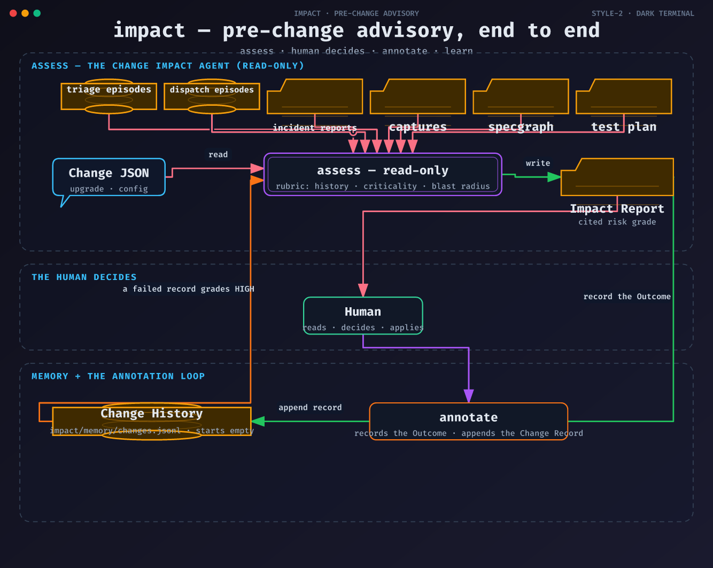

# impact

Pre-change advisory for the NetCortex stack. A proposed Change — an NF
software upgrade or a config change — is assessed against the
platform's existing evidence before it is applied: the episode stores,
the Change History, prior captures' dependency structure, the 3GPP
specgraph, and an optional human test plan. The deliverable is an
Impact Report — a risk grade with cited factors, affected NFs,
historical evidence, recommended pre-checks, and rollback criteria.
Read-only by design: the agent never applies a change, not even in the
sandbox lab — a human decides and applies, then records the Outcome
through the annotation loop, which alone writes the Change History.

Glossary: [`CONTEXT.md`](./CONTEXT.md) · read-only doctrine:
[`docs/adr/0001-read-only-change-assessment.md`](./docs/adr/0001-read-only-change-assessment.md)

## The workflow

Two subcommands, one artifact — the Impact Report.

### 1. `assess` — the read-only advisory

```
uv run impact assess change.json
uv run impact assess change.json \
  --dispatch-episodes tests/fixtures/dispatch_episodes.jsonl \
  --reports tests/fixtures/reports \
  --capture tests/fixtures/capture_n2.json \
  --specgraph tests/fixtures/specgraph.json \
  --test-plan tests/fixtures/plan.json
```

The Change record has a deliberately small vocabulary of two (the
shape is in [`CONTEXT.md`](./CONTEXT.md)):

```
{
  "type": "upgrade",
  "nf": "SMF",
  "from": "2.4.1",
  "to": "2.4.2"
}
```

```
{
  "type": "config",
  "key": "smf.heartbeat_interval",
  "from": "30",
  "to": "10"
}
```

Every evidence flag is optional — an absent store is named in the
report, never asserted clear. The report goes to stdout: `# Impact
Report`, the Change, `## CHANGE RISK: <grade>` with its cited factors,
then Affected Network Functions, Historical Evidence, Recommended
Pre-Checks, and Rollback Criteria.

### The rubric

Three factors, one fixed in code — historical evidence, dependency
criticality, blast radius — each cited to its source in the report.
Four grades: HIGH, MEDIUM, LOW, and INSUFFICIENT EVIDENCE; an
unknowable risk never prints as LOW. A Change matching a past failed
Change Record (same target, same class) grades HIGH through the
historical-evidence factor; a critical interface (SBI to UDM/AUSF, or
the N2 control plane's SBI face) inside the blast radius grades HIGH
through the dependency factor. Every claim line carries exactly one
marker — `[cited: source]` or `[predicted]` — and the renderer refuses
to emit a bare claim: with no lab, prediction must never read as
measurement.

### 2. `annotate` — the human annotation loop

```
uv run impact annotate report.md --change change.json --outcome applied
```

The Outcome vocabulary is fixed — `applied`, `rejected`, or
`rolled-back`. `annotate` appends the human's verdict onto the report
in place (an `## Outcome` section, no markers — it is the human's
record, not the agent's claim) and appends the Change Record to the
Change History store, `impact/memory/changes.jsonl` (JSONL,
append-only, created on first annotation; `--history-path` overrides).
The store gets the record before the report gets the verdict — the
store is what future assessments grade from. Guards: a report that
already carries an Outcome is refused, and so is anything else
malformed — nothing is written unless both writes can go through.
Exit codes are 0 on success, 2 on a usage error, 1 on any input or
evidence error, with the error named on stderr.

## Architecture



The diagram's source of truth is
[`docs/diagrams/impact-flow.json`](./docs/diagrams/impact-flow.json)
(fireworks-tech-graph IR); the render and PNG recipes are in
[`docs/diagrams/README.md`](./docs/diagrams/README.md).

**Read-only.** Nothing in the pipeline applies anything — the report is
the deliverable, and a human decides and applies. The only writer to
the Change History is the human's `annotate` loop, so the agent never
writes its own history and the first reports honestly say "no
historical evidence yet".

**Offline.** impact is deterministic end to end — no LLM calls, no
network. The rubric is fixed code over structured evidence; the test
suite runs offline with committed golden fixtures.

- [`docs/adr/0001-read-only-change-assessment.md`](./docs/adr/0001-read-only-change-assessment.md)
  — the read-only doctrine: the report is the deliverable, evidence is
  cited or predicted, and an unknowable risk is never graded LOW.
